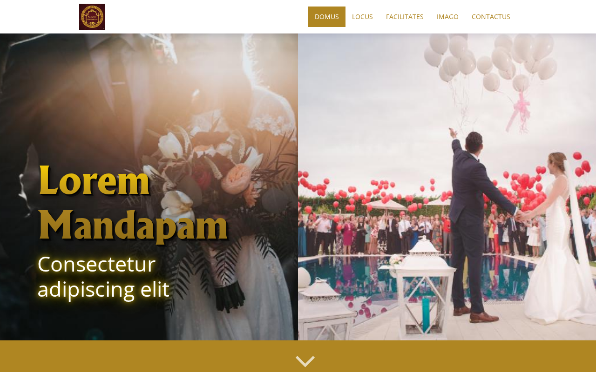
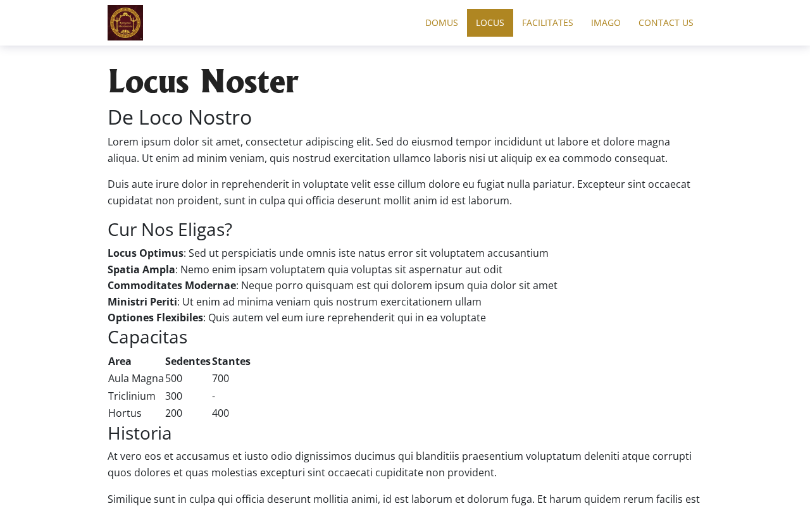
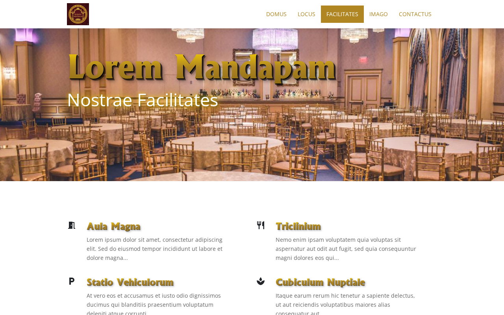
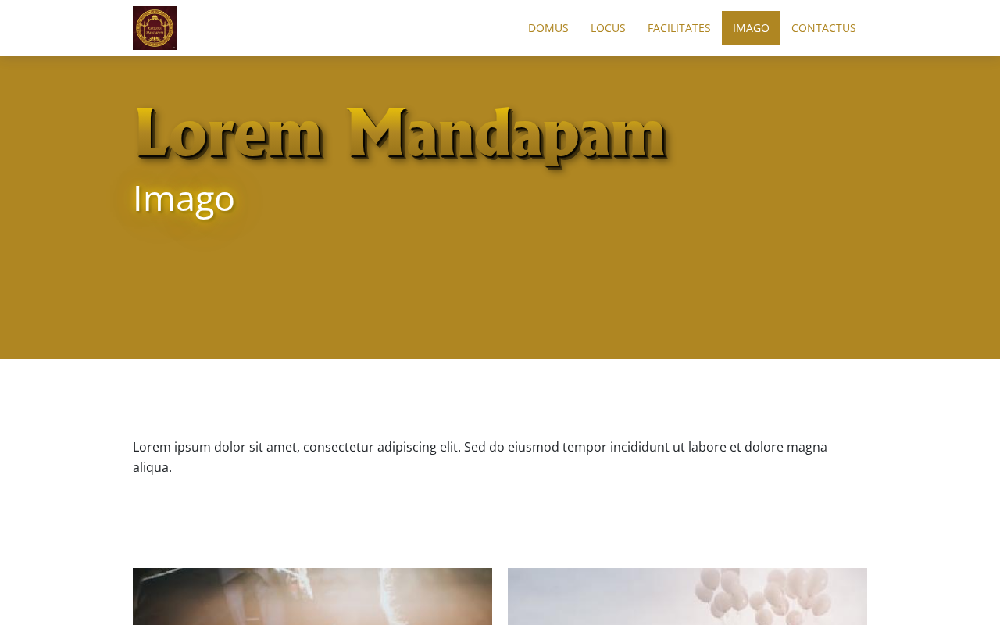
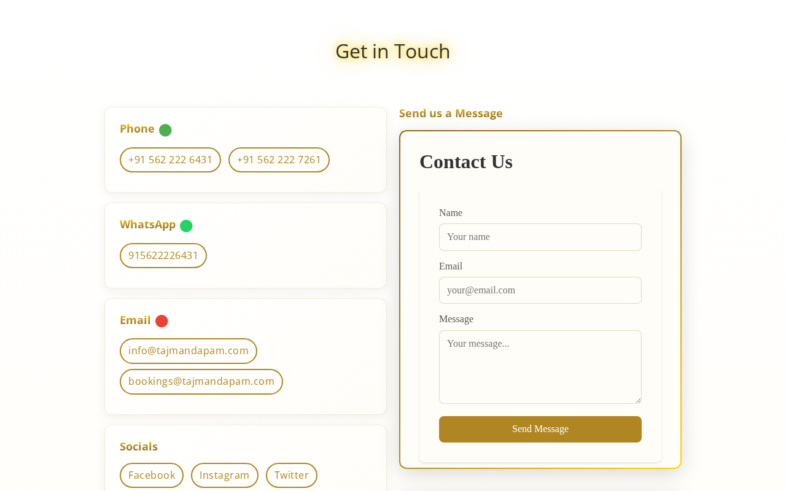
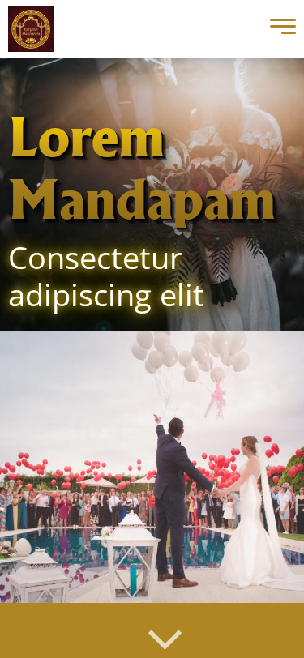

# Mandapam

A Hugo theme for event venues and wedding halls (mandapams).



## Features

- Responsive design with Bootstrap
- Homepage with hero split-screen, services, content strips, and contact section
- Facilities section with image galleries
- Gallery section with lightbox support (GLightbox)
- Venue page with hero image
- Integrated contact section with phone, WhatsApp, email, form, and map
- Calendar integration with [concierge-worker](https://github.com/ananthb/concierge-worker) for event views and booking
- Gold gradient heading styles with 3D shadow effects
- Configurable logo and site parameters
- PostCSS with autoprefixer for production builds
- SCSS styling with Bootstrap base

## Screenshots


<details>
<summary>More screenshots</summary>

### Venue


### Facilities


### Gallery


### Contact Section


### Mobile


</details>

## Installation

### As a Hugo Module (Recommended)

Add the theme to your Hugo site's configuration:

```toml
[module]
  [[module.imports]]
    path = "github.com/ananthb/mandapam-theme"
```

Then run:

```bash
hugo mod get -u
```

### As a Git Submodule

```bash
git submodule add https://github.com/ananthb/mandapam-theme.git themes/mandapam
```

## Configuration

### Site Parameters

```toml
[params]
  logo = "logos/logo.png"  # Path to logo image
  services_heading = "Our Services"  # Heading for services section
  google_analytics_id = ""  # Google Analytics ID
  github_repository = "user/repo"  # For commit info in footer
```

### Contact Data

Create `data/contact.toml`:

```toml
phone = ["+91 12345 67890"]
whatsapp = ["911234567890"]
email = ["info@example.com"]
address = "123 Street, City, State, Country"

[socials]
  Facebook = "https://facebook.com/example"
  Instagram = "https://instagram.com/example"

[map]
  iframe = '<iframe src="https://www.google.com/maps/embed?..." width="100%" height="300"></iframe>'
```

### Concierge Worker Integration

The theme supports contact forms, event calendars, and booking forms via [concierge-worker](https://github.com/ananthb/concierge-worker). Add to `data/contact.toml`:

```toml
[concierge]
  form_url = "https://concierge.example.com/f/your-form-slug"
  view_url = "https://concierge.example.com/view/your-calendar-id/your-slug"
  book_url = "https://concierge.example.com/book/your-calendar-id/your-slug"
  show_on_homepage = true
  view_title = "Event Calendar"
  booking_title = "Book Your Event"
```

A dedicated calendar page is available at `/calendar/`. You can also use shortcodes:

```markdown


```

### Menu

```toml
[menus]
  [[menus.main]]
    name = "Home"
    url = "/"
    weight = 10
  [[menus.main]]
    name = "Venue"
    url = "/venue/"
    weight = 20
  [[menus.main]]
    name = "Facilities"
    url = "/facilities/"
    weight = 30
  [[menus.main]]
    name = "Gallery"
    url = "/gallery/"
    weight = 40
  [[menus.main]]
    name = "Contact"
    url = "/#contact"
    weight = 50
```

## Content Types

### Homepage (`content/_index.md`)

```yaml
---
title: "Site Title"
heroLeftBackground: "images/left.jpg"
heroRightBackground: "images/right.jpg"
heroHeading: "Main Heading"
heroSubheading: "Subheading text"
---
```

### Facilities (`content/facilities/*.md`)

```yaml
---
title: "Facility Name"
heading: "Banner Heading"
icon: "meeting_room"  # Material Icons name
weight: 1
images:
  - "images/facility1.jpg"
  - "images/facility2.jpg"
---
```

### Gallery (`content/gallery/*.md`)

```yaml
---
title: "Event Name"
thumbnail: "images/thumb.jpg"
date: 2024-01-15
images:
  - "images/photo1.jpg"
  - "images/photo2.jpg"
---
```

## Development

### Prerequisites

- Hugo (extended version)
- Node.js
- Go

### Using Nix

```bash
nix develop
cd exampleSite
hugo server --buildDrafts
```

### Generate Screenshots

```bash
npm install
npm run screenshots
```

## License

MIT License - see [LICENSE](LICENSE) for details.
