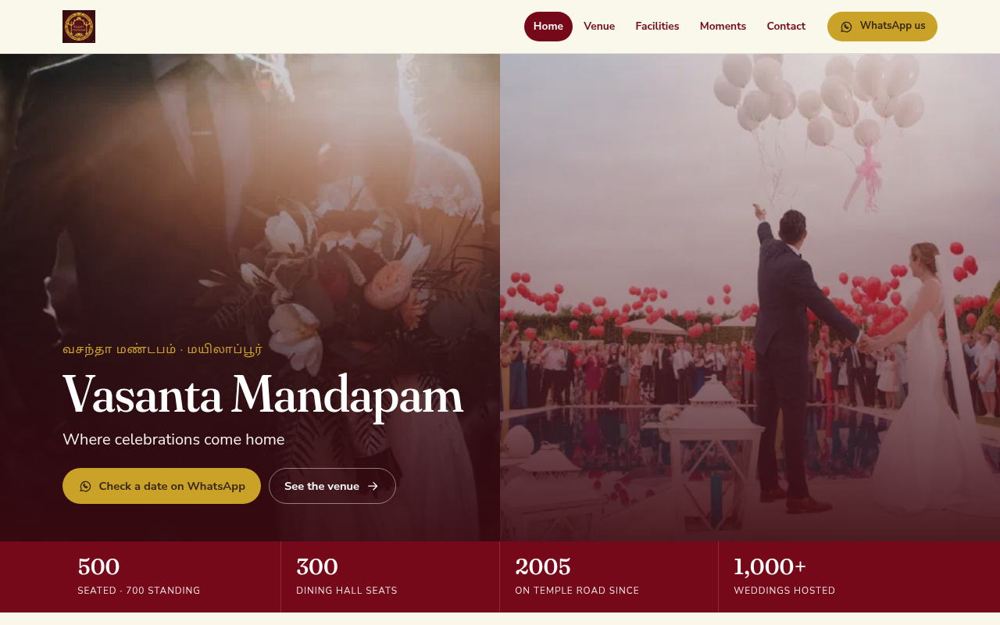
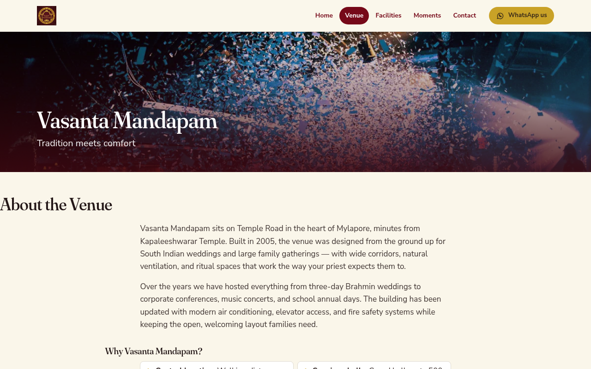
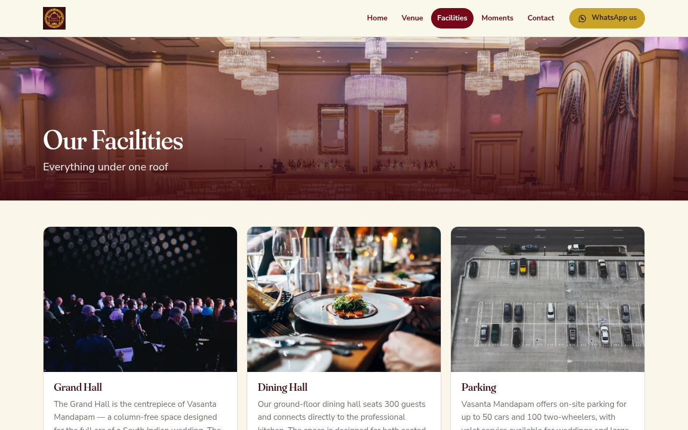
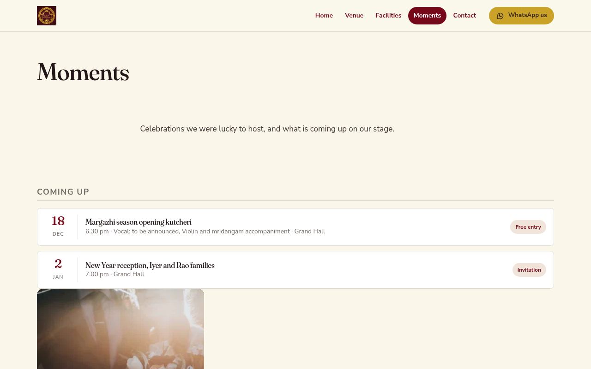
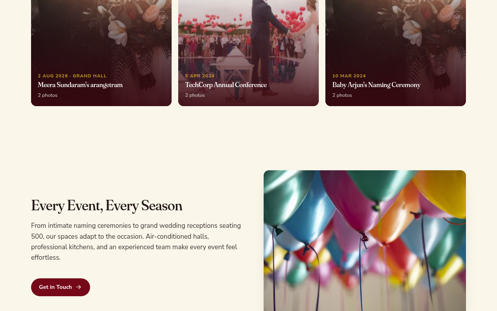
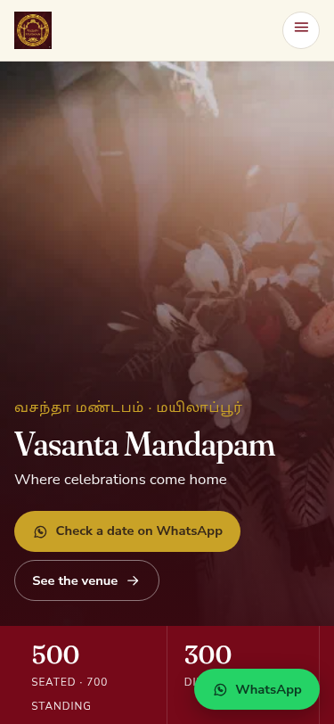

# Mandapam

A Hugo theme for wedding halls, auditoriums and event venues. Photo-led,
WhatsApp-first, and small: no Bootstrap, no icon font, three self-hosted
typefaces, one stylesheet.



## Features

- Split-photo hero with the venue's one call to action: a pre-filled WhatsApp chat
- Facts row, alternating photo-and-text strips, service cards, contact section with map
- **Moments**: dated photo posts with a cover, grouped by year, lightbox galleries
- **Programmes**: the same posts with a future date become an upcoming list
- Facilities with icons and photo galleries
- Site colours from a handful of params, so several venues can share the theme
- Fraunces, Nunito Sans and Noto Sans Tamil shipped as WOFF2 subsets; no third-party font requests
- Responsive WebP `srcset` for every image, EventVenue JSON-LD, proper OpenGraph tags
- Sticky WhatsApp button on phones
- Works as a Hugo module; content from the previous (Bootstrap) versions renders unchanged

<details>
<summary>More screenshots</summary>

### Venue


### Facilities


### Gallery


### Contact


### Mobile


</details>

## Installation

```toml
[module]
  [[module.imports]]
    path = "github.com/ananthb/mandapam-theme"
```

```bash
hugo mod get -u
```

Needs Hugo extended 0.128 or later (WebP image processing).

## Configuration

```toml
[params]
  logo = "logos/logo.png"                  # under assets/
  hero_eyebrow = "சக்தி பேலஸ் · வளசரவாக்கம்" # optional line above the hero heading
  hero_cta = "Check a date on WhatsApp"     # WhatsApp button label
  hero_button = "See the venues"           # secondary button
  hero_button_link = "#venues"
  whatsapp_message = "Hi, I'd like to check availability at Shakthi Palace for "
  services_kicker = "Under one roof"
  services_heading = "The venues"
  moments_heading = "Recent events"
  upcoming_heading = "Coming up"
  contact_heading = "Get in touch"
  google_analytics_id = ""
  gtm_id = ""

  # Colours. Defaults are maroon and gold.
  [params.theme]
    primary = "#5e2a63"
    primary_deep = "#2e1533"
    accent = "#f2a900"
    ivory = "#fbf7ee"
    ink = "#241b22"
    positive = "#25714b"

  # Optional facts row under the hero.
  [[params.facts]]
    value = "500"
    label = "seated · 1,000 floating"
  [[params.facts]]
    value = "3"
    label = "lifts, four levels"

  [params.homepage_meta_tags]
    meta_description = "…"
    meta_og_image = "https://example.com/logos/logo.png"
```

Add `disableKinds = ["taxonomy", "term"]` to the site config unless the site uses tags; the theme has no taxonomy templates.

### Contact data

`data/contact.yaml` (or `.toml`) drives the header button, the contact section, the
footer, the sticky WhatsApp button and the JSON-LD:

```yaml
businessName: Vasanta Mandapam
phone: ["+91 44 2345 6789"]
whatsapp: ["919876543210"]      # first number gets the buttons
email: ["events@example.com"]
address: |
  12 Temple Road,
  Mylapore, Chennai 600 004
map_link: https://maps.app.goo.gl/…   # optional "Directions" button
socials:
  Instagram: https://instagram.com/…
map:
  iframe: '<iframe src="https://www.google.com/maps/embed?…"></iframe>'
```

### Menu

```toml
[[menu.main]]
  name = "Home"
  url = "/"
  weight = 1
[[menu.main]]
  name = "Sangita Sabha"
  url = "https://shakthisangitasabha.com"   # external links open in a new tab
  weight = 2
```

## Content

### Home page `content/_index.md`

```toml
+++
title = 'Home'
heroHeading = 'A million reasons to celebrate'
heroSubheading = "Fully air-conditioned kalyana mandapam in the heart of Chennai"
heroLeftBackground = 'images/front.jpg'
heroRightBackground = 'images/stage.jpg'    # optional second photo
+++
```

Home page order: hero, facts, first strip, services, latest moments (and upcoming
programmes when there are any), remaining strips, contact.

### Strips `content/homepage/*.md`

A headless bundle (`content/homepage/index.md` with `headless = true`). Each page
resource is one strip, ordered by `weight`: `title`, `background`, optional `button`
and `buttonLink`, body text. Strips alternate photo left and right. A strip with a
photo and no text renders as a full-width photo band.

### Services `content/services/*.md`

Another headless bundle. `title`, `icon`, `link`, optional `image` and `kicker`,
body as a bullet list. Icon names: `event`, `cake`, `music_note`, `restaurant`,
`kitchen`, `deck`, `night_shelter`, `apartment`, `meeting_room`, `groups`, `ac_unit`,
`elevator`, `power`, `waves`, `local_parking`, `park`, `festival`, `celebration`,
`self_improvement`, `spa`, `favorite`, `book_online`, `all_inclusive`. Anything else
draws a lotus.

### Venue pages

A leaf bundle with `type = 'venue'`, `heroHeading`, optional `heroBackground`, and
`` in the body to place its own strips (page resources with
`weight`, `background`, body). Inside a strip, `` renders chips
from the strip's front matter:

```toml
features = ['Fire certified', '125 kVA generator', 'Rooftop dining for 300']
rules = ['Vegetarian only', 'No smoking or alcohol', 'No plastic']
```

### Facilities `content/facilities/*.md`

`title`, `heading`, `icon`, `weight`, optional `images` list. The section's
`_index.md` takes `heroHeading`, `heroBackground` and an intro.

### Moments `content/moments/…`

Dated photo posts. Also read from `gallery/` and `events/` sections, so older sites
keep working. Page bundles keep the photos beside the post:

```
content/moments/2026/krishnamurthy-reception/
  index.md
  cover.webp
  01.webp …
```

```toml
+++
title = 'Reception for the Krishnamurthy family'
date = 2026-09-14
venue = 'Grand Wedding Hall'
cover = 'cover.webp'
photos = ['01.webp', '02.webp']
+++
A line or two about the evening.
```

`thumbnail` and `images` are accepted as aliases. Paths resolve against the bundle
first, then `assets/`.

### Programmes

A moment with a date in the future is a programme. Extra fields: `time` (free
text), `artists` (list), `entry` (`Free entry`, `Tickets`, …), `booking` (URL),
`booking_label`. Set `buildFuture = true` in the site config or Hugo skips them. Upcoming ones list first on the section page and in a
"Coming up" block on the home page. Hugo decides at build time, so rebuild the site
daily (a scheduled deploy hook) to move past programmes down on their own.

### Sveltia CMS

The `moments` collection with photos beside the post and resized on upload:

```yaml
media_libraries:
  default:
    config:
      max_file_size: 20000000
      slugify_filename: true
      transformations:
        raster_image: { format: webp, quality: 85, width: 1600, height: 1600 }

collections:
  - name: moments
    label: Moments
    folder: content/moments
    path: "{{year}}/{{slug}}/index"
    media_folder: ""
    public_folder: ""
    extension: md
    format: toml-frontmatter
    create: true
    preview_path: "/moments/{{year}}/{{slug}}/"
    thumbnail: cover
    sortable_fields:
      fields: [date, title]
      default: { field: date, direction: descending }
    fields:
      - { name: title, label: What was it, widget: string }
      - { name: date, label: When, widget: datetime, time_format: false, default: "{{now}}" }
      - { name: venue, label: Where, widget: select, required: false, options: [Grand Wedding Hall, Mini Hall] }
      - { name: cover, label: Cover photo, widget: image }
      - { name: photos, label: Photos, widget: image, multiple: true }
      - { name: body, label: A line or two, widget: markdown, required: false }
```

with `permalinks.moments = "/moments/:year/:slug/"` in the site config.

## Development

```bash
nix develop
cd exampleSite
hugo server
```

`npm run screenshots` regenerates the images in `images/` with Playwright.

## License

MIT. Fraunces, Nunito Sans and Noto Sans Tamil are under the SIL Open Font License.
